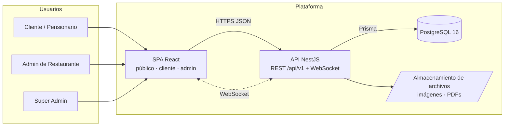
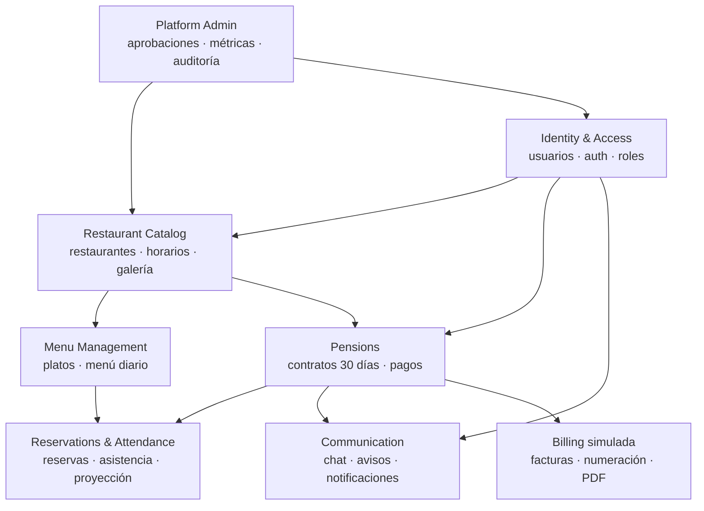
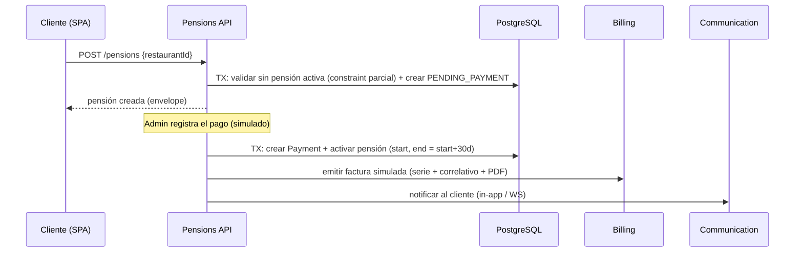
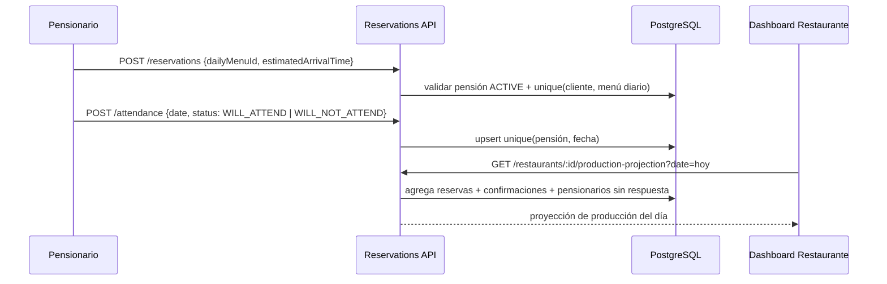
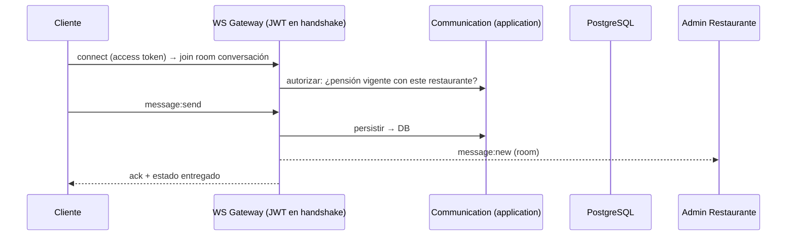

# arquitectura.md

> Arquitectura general del sistema, bounded contexts, diagramas, flujo de datos
> y responsabilidades. Complementa a [database-design.md](database-design.md)
> (modelo de datos) y [security.md](security.md) (modelo de amenazas).

---

## 1. Decisión de alto nivel: monolito modular hexagonal

**Decisión:** un único backend NestJS organizado como **monolito modular** con
**arquitectura hexagonal (ports & adapters)** por bounded context, y una única
SPA React con tres superficies (pública, cliente, administración).

**Por qué (trade-offs):**

- Microservicios darían aislamiento, pero para un producto de este tamaño y un
  equipo de una persona, el costo operativo (red, observabilidad, consistencia
  eventual) supera con creces el beneficio. Un monolito modular da los mismos
  límites lógicos con costo de infraestructura mínimo.
- La estructura por bounded context con puertos/adaptadores mantiene el dominio
  independiente de NestJS y Prisma: si mañana un contexto necesita extraerse a
  servicio propio (p. ej. Chat), sus límites ya existen.
- DDD se aplica **donde aporta**: Pensions y Reservations & Attendance tienen
  reglas de negocio ricas (estados, invariantes, fechas) y usan entidades de
  dominio explícitas. Catálogos simples (platos, galería) usan CRUD directo sin
  ceremonia innecesaria (KISS).

## 2. Vista de contexto



- **Un solo origen de datos**: PostgreSQL. Sin caches distribuidos en v1.
- **Comunicación**: REST para todo lo transaccional; WebSocket (Socket.IO)
  exclusivamente para chat y push de notificaciones/avisos.
- **Archivos** (logos, galería, PDFs de factura): disco local montado en Docker
  en v1, detrás de un puerto `FileStorage` para migrar a S3-compatible sin
  tocar el dominio.

## 3. Bounded contexts



| Contexto | Responsabilidad | Depende de |
|----------|-----------------|------------|
| **Identity & Access** | Registro, login, JWT + refresh, RBAC, perfil de usuario | — |
| **Restaurant Catalog** | Alta/edición de restaurantes, estados (pending/approved/suspended), horarios, galería, catálogo público | IAM |
| **Menu Management** | Platos por categoría, menú diario por fecha, publicación | Catalog |
| **Pensions** | Contratación 30 días, ciclo de vida, pagos, vencimientos, expiración automática | IAM, Catalog |
| **Reservations & Attendance** | Reserva del menú diario, hora estimada, cancelación, confirmación de asistencia, proyección de producción | Menu, Pensions |
| **Communication** | Conversaciones pensionario↔admin, mensajes en tiempo real, avisos broadcast, notificaciones in-app | IAM, Pensions |
| **Billing** | Emisión simulada: serie/numeración correlativa, PDF, historial. Puerto `InvoiceIssuer` para emisor real futuro | Pensions |
| **Platform Admin** | Aprobación/suspensión de restaurantes, gestión de usuarios, métricas, auditoría | todos (solo lectura + comandos admin) |

**Regla de dependencia:** un contexto solo consume a otro a través de su capa
de aplicación (servicios exportados por el módulo NestJS), nunca tocando sus
tablas por Prisma directamente. Las flechas del diagrama son las únicas
dependencias permitidas.

## 4. Arquitectura hexagonal por módulo (backend)

Estructura de cada bounded context dentro de `backend/src/modules/<context>/`:

```text
modules/pensions/
├── domain/                  # Núcleo. Sin imports de Nest ni Prisma.
│   ├── pension.entity.ts    #   entidades y value objects
│   ├── pension-status.ts    #   máquina de estados
│   └── pension.errors.ts    #   errores de dominio tipados
├── application/             # Casos de uso. Orquesta dominio + puertos.
│   ├── ports/               #   interfaces: PensionRepository, Clock, ...
│   └── use-cases/           #   contract-pension, register-payment, expire-pensions
├── infrastructure/          # Adaptadores. Implementan los puertos.
│   ├── prisma/              #   PensionPrismaRepository
│   └── jobs/                #   cron de expiración
├── presentation/            # Entrada HTTP/WS.
│   ├── pensions.controller.ts
│   └── dto/                 #   DTOs con class-validator (borde de la app)
└── pensions.module.ts       # Wiring de DI (providers = { puerto: adaptador })
```

- **domain/** no conoce el framework: testeable en aislamiento puro.
- **application/ports/** define interfaces; NestJS DI inyecta la implementación
  concreta (`{ provide: PENSION_REPOSITORY, useClass: PensionPrismaRepository }`).
  Cambiar Prisma, el reloj o el emisor de facturas no toca dominio ni casos de uso.
- **presentation/** valida en el borde (DTOs) y traduce errores de dominio al
  envelope estándar. Los controladores no contienen lógica de negocio.
- Contextos CRUD simples (Catalog, Menu) pueden colapsar domain/application en
  un servicio, manteniendo puertos solo donde hay variabilidad real (YAGNI).

### Módulo transversal `core/`

- Envelope global de respuesta: `{ success, data, error }`; listados paginados
  `{ items, meta: { total, page, limit } }`.
- Filtro global de excepciones → errores `{ code, message }` (mensaje en
  español, `code` slug estable en inglés).
- `ValidationPipe` global (whitelist, forbidNonWhitelisted, transform).
- Guards de auth/roles, decoradores, throttling, logging estructurado, config tipada.

## 5. Frontend

Una SPA (`frontend/`) con tres superficies por rol, organizada por feature:

```text
frontend/src/
├── app/                # router, providers (Query, tema), guards por rol
├── features/           # espejo de los bounded contexts
│   ├── auth/  restaurants/  menus/  pensions/
│   ├── reservations/  attendance/  chat/  notifications/
│   └── admin/  super-admin/
│       └── <feature>/{components, hooks, api, schemas}
├── components/ui/      # primitivas shadcn/ui + wrappers del design system
├── lib/                # apiClient (fetch + envelope), socket, utils
├── stores/             # Zustand: sesión, UI global (solo estado cliente)
└── styles/             # tokens.css (fuente de verdad del design system)
```

**Reparto de estado (regla estricta):**

| Tipo de estado | Herramienta |
|----------------|-------------|
| Estado de servidor (restaurantes, menús, pensiones…) | TanStack Query — nunca duplicado en Zustand |
| Sesión y UI global (usuario actual, tema, sidebar) | Zustand |
| Formularios | React Hook Form + Zod (schemas compartidos por feature) |
| Estado compartible (filtros, tab activa, paginación) | URL (search params) |

## 6. Flujos de datos clave

### 6.1 Contratación de pensión y pago



### 6.2 Día de operación: reserva, asistencia y proyección



### 6.3 Chat en tiempo real



El gateway WS es un **adaptador de presentación** más: reutiliza los mismos
casos de uso de `application/` que el REST; la autorización no se duplica.

## 7. Decisiones registradas (mini-ADR)

| # | Decisión | Alternativa descartada | Razón |
|---|----------|------------------------|-------|
| 1 | Monolito modular | Microservicios | Costo operativo injustificado a esta escala; límites lógicos ya definidos |
| 2 | Hexagonal selectivo | Hexagonal en todo / MVC plano | Puertos donde hay reglas ricas o variabilidad (Pensions, Billing); CRUD directo donde no (KISS) |
| 3 | Socket.IO sobre gateway Nest | SSE / polling | Chat bidireccional + rooms + reconexión resueltos; integra con guards de Nest |
| 4 | Prisma + PostgreSQL | TypeORM / MySQL | Stack obligatorio; Prisma da tipos end-to-end y migraciones declarativas |
| 5 | Archivos en disco tras puerto `FileStorage` | S3 desde el día 1 | Portafolio corre local con Docker; el puerto deja la migración a S3 barata |
| 6 | Facturación tras puerto `InvoiceIssuer` | Acoplar simulación al dominio | Requisito explícito: reemplazar simulación por emisor real sin tocar dominio |
| 7 | Una SPA con tres superficies | Tres apps separadas | Comparte design system, auth y tooling; code-splitting por ruta mantiene los bundles a raya |

## 8. Estructura de repositorio (objetivo)

```text
Pensiones/
├── docs/                  # esta documentación
├── backend/
│   ├── prisma/            # schema.prisma, migraciones, seed
│   └── src/
│       ├── core/          # envelope, filtros, guards, config
│       └── modules/       # un directorio por bounded context
├── frontend/
│   └── src/               # ver §5
├── docker-compose.yml     # desarrollo: db (+ adminer)
└── docker-compose.prod.yml
```
