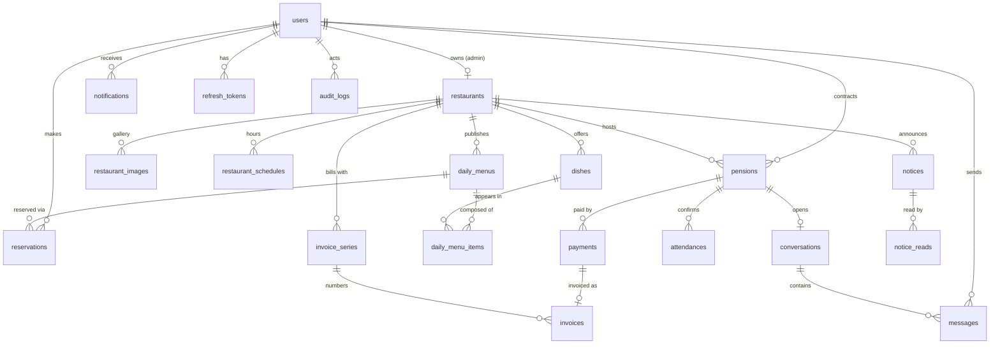

# database-design.md

> Modelo de datos de la plataforma. Es el insumo directo de la **Fase 1**
> (schema de Prisma + migración inicial). Motor: **PostgreSQL 16**, ORM: **Prisma**.

---

## 1. Convenciones

- Tablas y columnas en `snake_case` (Prisma mapea a modelos `PascalCase` con `@@map`).
- PK: `id UUID` (`gen_random_uuid()`). Sin IDs secuenciales expuestos (evita enumeración).
- Timestamps: `created_at`, `updated_at` (`timestamptz`, UTC) en tablas de
  entidades mutables. Tablas append-only o inmutables llevan solo `created_at`
  (o su equivalente: `read_at`, `published_at`); sin `updated_at` a propósito.
- Borrado: **soft delete solo donde el negocio lo pide** (`deleted_at` en
  `users` y `restaurants`); el resto usa borrado real o estados.
- Dinero: `numeric(10,2)`. Nunca `float`.
- Fechas de negocio (menú del día, asistencia): `date` — el día operativo es
  local al restaurante, no un instante.
- Enums nativos de PostgreSQL vía `enum` de Prisma.

## 2. Diagrama entidad-relación



## 3. Entidades

### 3.1 Identity & Access

#### `users`

| Columna | Tipo | Notas |
|---------|------|-------|
| id | uuid PK | |
| email | citext | **UNIQUE parcial** `WHERE deleted_at IS NULL` — un soft delete libera el email para re-registro |
| password_hash | text | bcrypt, nunca expuesto en API |
| full_name | varchar(120) | |
| phone | varchar(30) NULL | |
| role | enum `user_role` | `CLIENT` · `RESTAURANT_ADMIN` · `SUPER_ADMIN` |
| status | enum `user_status` | `ACTIVE` · `SUSPENDED` |
| deleted_at | timestamptz NULL | soft delete |

#### `refresh_tokens`

| Columna | Tipo | Notas |
|---------|------|-------|
| id | uuid PK | |
| user_id | uuid FK → users **ON DELETE CASCADE** | |
| token_hash | text | hash del token, nunca el token en claro |
| family_id | uuid | rotación: robo detectado ⇒ revocar familia completa |
| expires_at / revoked_at | timestamptz | |

Índices: `(user_id)`, `(family_id)`, **UNIQUE** `(token_hash)`.

### 3.2 Restaurant Catalog

#### `restaurants`

| Columna | Tipo | Notas |
|---------|------|-------|
| id | uuid PK | |
| owner_id | uuid FK → users **ON DELETE RESTRICT** | **UNIQUE parcial** `WHERE deleted_at IS NULL` — un restaurante vivo por admin (v1) |
| name | varchar(120) | |
| slug | varchar(140) | **UNIQUE parcial** `WHERE deleted_at IS NULL` — URLs públicas; el slug se libera al borrar |
| description | text | |
| logo_url / cover_image_url | text NULL | |
| address | varchar(255) | |
| latitude / longitude | numeric(9,6) NULL | |
| contact_phone / contact_email | | |
| status | enum `restaurant_status` | `PENDING` · `APPROVED` · `SUSPENDED` |
| monthly_pension_price | numeric(10,2) | precio vigente del plan 30 días |
| deleted_at | timestamptz NULL | |

Índices: parcial `(status) WHERE deleted_at IS NULL` — el catálogo público
filtra `status = 'APPROVED' AND deleted_at IS NULL`; el índice calza con el
predicado real.

#### `restaurant_images`

`id`, `restaurant_id` FK **CASCADE**, `url`, `sort_order int`.
UNIQUE `(restaurant_id, sort_order)`.

#### `restaurant_schedules`

`id`, `restaurant_id` FK **CASCADE**, `day_of_week smallint` (0=domingo…6),
`opens_at time`, `closes_at time`.
UNIQUE `(restaurant_id, day_of_week)` · CHECK `(opens_at < closes_at)` ·
CHECK `(day_of_week BETWEEN 0 AND 6)`.

### 3.3 Menu Management

#### `dishes`

| Columna | Tipo | Notas |
|---------|------|-------|
| id | uuid PK | |
| restaurant_id | uuid FK **CASCADE** | |
| name | varchar(120) | |
| description | text NULL | |
| category | enum `dish_category` | `STARTER` · `MAIN` · `BEVERAGE` · `DESSERT` |
| price | numeric(10,2) | CHECK `(price >= 0)` — precio individual |
| image_url | text NULL | |
| is_active | boolean default true | inactivo = no seleccionable en nuevos menús |

Índices: `(restaurant_id, category)`.

#### `daily_menus`

| Columna | Tipo | Notas |
|---------|------|-------|
| id | uuid PK | |
| restaurant_id | uuid FK **CASCADE** | |
| menu_date | date | |
| status | enum `menu_status` | `DRAFT` · `PUBLISHED` |
| menu_price | numeric(10,2) | precio del menú completo del día |

**UNIQUE `(restaurant_id, menu_date)`** — un menú por restaurante y día.
Índice `(menu_date, status)` para "menús de hoy publicados".

#### `daily_menu_items`

`id`, `daily_menu_id` FK **CASCADE**, `dish_id` FK **RESTRICT**,
`course` enum `dish_category`.
UNIQUE `(daily_menu_id, dish_id)`. RESTRICT en `dish_id`: un plato usado en
menús históricos no se borra, se desactiva (`is_active = false`).

### 3.4 Pensions

#### `pensions`

| Columna | Tipo | Notas |
|---------|------|-------|
| id | uuid PK | |
| client_id | uuid FK → users **RESTRICT** | |
| restaurant_id | uuid FK → restaurants **RESTRICT** | |
| start_date / end_date | date | duración fija: `end_date = start_date + 30 días` |
| price | numeric(10,2) | congelado al contratar (histórico inmutable) |
| status | enum `pension_status` | `PENDING_PAYMENT` · `ACTIVE` · `EXPIRED` · `CANCELLED` · `SUSPENDED` |

**Constraints críticas (invariantes de negocio en DB, no solo en código):**

```sql
CREATE UNIQUE INDEX uq_live_pension_per_client_restaurant
  ON pensions (client_id, restaurant_id)
  WHERE status IN ('PENDING_PAYMENT', 'ACTIVE');
```

CHECK `chk_pension_30_days (end_date = start_date + 30)` — la duración fija de
30 días es constraint, no convención. Uniques compuestas `(id, client_id)` y
`(id, restaurant_id)` existen como destino de las FKs compuestas de
`reservations` y `attendances` (consistencia cruzada, ver §3.5).

Índices: `(client_id)` (historial "mis pensiones"), `(restaurant_id, status)`,
`(status, end_date)` — el cron de expiración busca `ACTIVE` con `end_date < hoy`.
"Días restantes" **se calcula**, nunca se almacena (evita estado derivado desincronizado).

#### `payments`

| Columna | Tipo | Notas |
|---------|------|-------|
| id | uuid PK | |
| pension_id | uuid FK **RESTRICT** | |
| amount | numeric(10,2) | CHECK `(amount > 0)` |
| method | enum `payment_method` | `CASH` · `TRANSFER` · `CARD` (simulado) |
| status | enum `payment_status` | `PENDING` · `CONFIRMED` · `VOIDED` |
| paid_at | timestamptz NULL | |
| registered_by | uuid FK → users | admin que registró el pago (auditoría) |

### 3.5 Reservations & Attendance

#### `reservations`

| Columna | Tipo | Notas |
|---------|------|-------|
| id | uuid PK | |
| client_id | uuid FK **RESTRICT** | |
| daily_menu_id | uuid FK **RESTRICT** | la fecha y el restaurante se derivan del menú |
| pension_id | uuid FK NULL | NULL ⇒ reserva suelta sin pensión (precio del día) |
| estimated_arrival | time | |
| status | enum `reservation_status` | `CONFIRMED` · `CANCELLED` · `FULFILLED` · `NO_SHOW` |
| notes | varchar(255) NULL | |

**UNIQUE parcial `(client_id, daily_menu_id) WHERE status <> 'CANCELLED'`** —
una reserva viva por cliente y menú; cancelar permite volver a reservar.
**FK compuesta `(pension_id, client_id) → pensions(id, client_id)`** — la DB
garantiza que la pensión referenciada pertenece al cliente de la reserva
(filas con `pension_id NULL` quedan exentas, MATCH SIMPLE).
Índices: `(daily_menu_id, status)` para "reservas del día", `(client_id)` y
`(pension_id)` para historiales.

#### `attendances`

| Columna | Tipo | Notas |
|---------|------|-------|
| id | uuid PK | |
| pension_id | uuid FK **CASCADE** | |
| restaurant_id | uuid FK **RESTRICT** | denormalizado de la pensión (inmutable) para consultar por restaurante+fecha sin join |
| attendance_date | date | |
| status | enum `attendance_status` | `WILL_ATTEND` · `WILL_NOT_ATTEND` · `ATTENDED` · `NO_SHOW` |
| confirmed_at | timestamptz | |

**UNIQUE `(pension_id, attendance_date)`** — una confirmación por día (upsert).
**FK compuesta `(pension_id, restaurant_id) → pensions(id, restaurant_id)`** —
la denormalización no puede divergir de la pensión.
Índice `(restaurant_id, attendance_date, status)` — proyección de producción
diaria directa por restaurante y fecha.
`attendance_date` dentro de `[start_date, end_date]` de la pensión se valida
en aplicación (ver "Invariantes a nivel de aplicación").

### 3.6 Communication

#### `conversations`

`id`, `pension_id` FK **UNIQUE** **CASCADE** — una conversación por pensión
(el canal cliente↔restaurante existe mientras exista la relación comercial;
el historial sobrevive a la expiración de la pensión).

#### `messages`

`id`, `conversation_id` FK **CASCADE**, `sender_id` FK → users (indexado),
`content text` (CHECK `length(content) <= 2000`), `read_at timestamptz NULL`.
Índice `(conversation_id, created_at DESC, id DESC)` — paginación por cursor
compuesto `(created_at, id)`: el `id` desempata mensajes con el mismo timestamp.

#### `notices`

`id`, `restaurant_id` FK **CASCADE**, `title varchar(140)`, `body text`,
`type` enum `notice_type` (`MENU_CHANGE` · `SCHEDULE_CHANGE` · `PROMOTION` ·
`CLOSURE` · `GENERAL`), `published_at`.
Destinatarios: pensionarios con pensión `ACTIVE` del restaurante **al momento
de publicar** (se materializa en `notifications`, no se recalcula).

#### `notice_reads`

`notice_id` FK **CASCADE** + `user_id` FK **CASCADE** (PK compuesta), `read_at`.

#### `notifications`

`id`, `user_id` FK **CASCADE**, `type` enum `notification_type`
(`NOTICE` · `PENSION_EXPIRING` · `PAYMENT_DUE` · `NEW_MESSAGE` · `RESERVATION` · `SYSTEM`),
`payload jsonb` (referencias: `noticeId`, `pensionId`…), `read_at NULL`.
Índice parcial `(user_id) WHERE read_at IS NULL` — contador de no leídas.

### 3.7 Billing (simulada)

#### `invoice_series`

`id`, `restaurant_id` FK, `series varchar(10)` (p. ej. `F001`),
`next_number int default 1`. UNIQUE `(restaurant_id, series)`.
La numeración correlativa se asigna con `SELECT ... FOR UPDATE` sobre esta fila
⇒ sin huecos ni duplicados bajo concurrencia.

#### `invoices`

| Columna | Tipo | Notas |
|---------|------|-------|
| id | uuid PK | |
| payment_id | uuid FK **UNIQUE** **RESTRICT** | 1:1 — una factura por pago confirmado |
| series_id | uuid FK → invoice_series | |
| number | int | |
| issued_at | timestamptz | |
| total | numeric(10,2) | |
| pdf_url | text NULL | generado async |
| status | enum `invoice_status` | `ISSUED` · `VOIDED` |

**UNIQUE `(series_id, number)`**. Las facturas nunca se borran: se anulan (`VOIDED`).

### 3.8 Auditoría

#### `audit_logs`

`id`, `actor_id` FK → users NULL (acciones de sistema/cron ⇒ NULL),
`action varchar(60)` (slug: `pension.activated`, `restaurant.approved`…),
`entity_type varchar(40)`, `entity_id uuid`, `metadata jsonb`, `created_at`.
Solo-append: sin `updated_at`, sin UPDATE ni DELETE desde la aplicación.
Índices: `(entity_type, entity_id)`, `(actor_id, created_at DESC)`.

## 4. Resumen de invariantes garantizadas en DB

| Invariante | Mecanismo |
|------------|-----------|
| Email único por usuario vivo | UNIQUE parcial `users.email WHERE deleted_at IS NULL` (citext) |
| Un restaurante vivo por admin (v1) | UNIQUE parcial `restaurants.owner_id WHERE deleted_at IS NULL` |
| Slug único entre restaurantes vivos | UNIQUE parcial `restaurants.slug WHERE deleted_at IS NULL` |
| Un menú por restaurante y día | UNIQUE `(restaurant_id, menu_date)` |
| Una pensión viva por cliente y restaurante | UNIQUE parcial sobre `pensions` |
| Pensión dura exactamente 30 días | CHECK `end_date = start_date + 30` |
| La pensión de una reserva pertenece a su cliente | FK compuesta `reservations(pension_id, client_id) → pensions(id, client_id)` |
| La asistencia apunta al restaurante de su pensión | FK compuesta `attendances(pension_id, restaurant_id) → pensions(id, restaurant_id)` |
| Una reserva viva por cliente y menú diario | UNIQUE parcial sobre `reservations` |
| Una confirmación de asistencia por día | UNIQUE `(pension_id, attendance_date)` |
| Pago CONFIRMED siempre tiene `paid_at` | CHECK `status <> 'CONFIRMED' OR paid_at IS NOT NULL` |
| Numeración de factura sin duplicados | UNIQUE `(series_id, number)` + `FOR UPDATE` |
| Una factura por pago | UNIQUE `invoices.payment_id` |
| Históricos no se rompen al borrar | FK `RESTRICT` en `daily_menu_items.dish_id`, `pensions.client_id`/`restaurant_id`, `payments.pension_id` |

### Invariantes a nivel de aplicación (decisión explícita)

Estas reglas cruzan tablas y se validan **solo en la capa de aplicación**
(casos de uso de NestJS); un trigger sería el único mecanismo en DB y no
justifica su complejidad aquí (KISS). Cada una debe tener test de integración:

1. `attendance_date` dentro de `[start_date, end_date]` de la pensión.
2. `daily_menu_items.course` coincide con `dishes.category` del plato referenciado.
3. Las reservas solo se crean contra menús `PUBLISHED` (nunca `DRAFT`).
4. Solo pensiones `ACTIVE` pueden registrar asistencia.

### Decisiones diferidas (registradas)

- **UUIDv7 en tablas append-heavy** (`messages`, `notifications`, `audit_logs`):
  v4 aleatorio fragmenta el B-tree bajo alto volumen de inserts. A escala de
  portafolio no importa; si se optimiza, migrar el default de esas tablas a
  UUIDv7 manteniendo v4 en el resto.
- **Rol de DB de mínimo privilegio para el runtime** — ✅ implementado en
  Fase 2: `backend/prisma/sql/runtime-role.sql` crea `pensiones_app` (sin DDL;
  `audit_logs` solo `SELECT/INSERT` ⇒ append-only forzado por permisos;
  `_prisma_migrations` inaccesible). Se aplica con `pnpm db:grants` y debe
  **re-ejecutarse tras cada migración** para cubrir tablas nuevas. El runtime
  de NestJS conecta con `APP_DATABASE_URL` (este rol); la CLI de Prisma usa
  `DATABASE_URL` (owner). Los roles viven fuera de las migraciones (son
  objetos de clúster y llevarían secretos al repo).

## 5. Estrategia de migraciones

1. **Herramienta:** Prisma Migrate. Una migración inicial (`init`) con el
   modelo completo de este documento; a partir de ahí, migraciones pequeñas y
   aditivas por fase.
2. **Constraints que Prisma no expresa** (índices únicos parciales, CHECKs,
   `citext`, FKs compuestas) se añaden **editando el SQL de la migración
   generada** antes de aplicarla — nunca a mano contra la DB. Quedan
   versionadas como el resto.
   - El diff de Prisma **ignora** los índices parciales y los CHECKs (estables
     para siempre), pero **sí detecta y propondrá eliminar** estos 4 objetos en
     cada migración futura generada: `uq_pensions_id_client`,
     `uq_pensions_id_restaurant`, `fk_reservation_pension_client`,
     `fk_attendance_pension_restaurant`. **Regla de revisión:** borrar esos
     `DROP`/`ALTER` del SQL generado antes de aplicar. Verificable con
     `prisma migrate diff --from-migrations --to-schema-datamodel`.
3. **Regla de compatibilidad:** las migraciones no reescriben historia; para
   cambios destructivos, patrón expand → migrate data → contract.
4. **Entornos:** `migrate dev` en local, `migrate deploy` en CI/producción.
   La suite de integración corre contra una DB efímera creada desde cero con
   las migraciones reales (valida que `deploy` siempre funciona).
5. **Seed** (`prisma/seed.ts`): idempotente (upserts). Crea: 1 super admin,
   3 restaurantes (uno por estado), admins, platos y menús de 7 días, 5
   clientes, pensiones en varios estados, reservas/asistencias del día, y una
   conversación con mensajes. Es la base de las demos y de los tests E2E.
